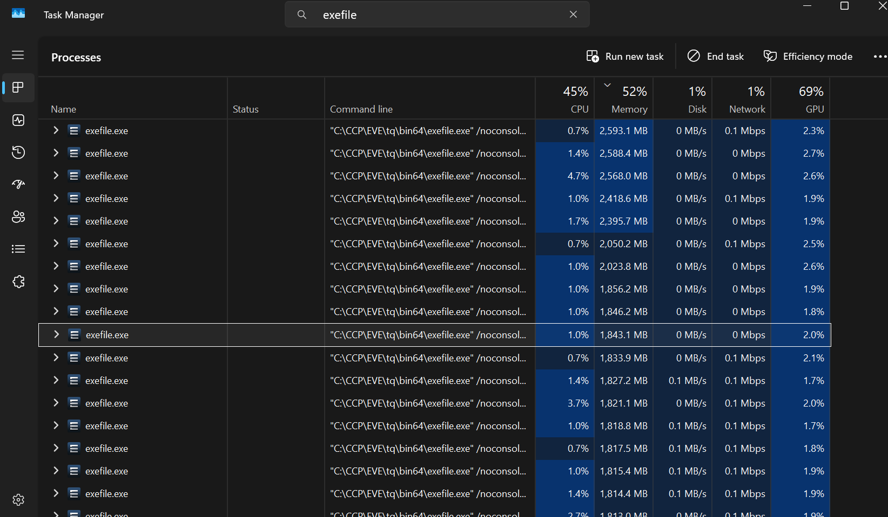
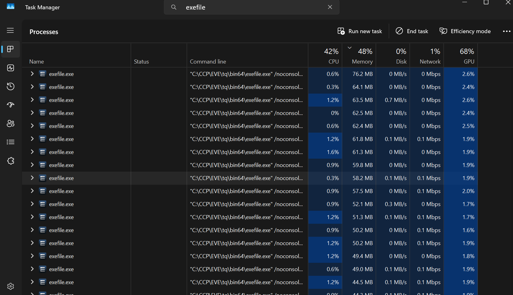

# EVE RAM Limiter

This utility tries to limit memory usage of EVE Online client processes by trimming their working sets. Several similar utilities exists for other applications [RAMLimiter](https://github.com/daddyonzaza/RAMLimiter), [discord-ram-limiter](https://github.com/farajyeet/discord-ram-limiter) or similar functionality [islc](https://www.wagnardsoft.com/forums/viewtopic.php?t=1256), [rammap](https://learn.microsoft.com/en-us/sysinternals/downloads/rammap). However, none exists yet that specifically makes it convenient for eve online players.

## What It Does

This tool periodically trims the working set (physical RAM usage) of all running EVE Online processes (`exefile.exe`). This forces Windows to page out unused memory, freeing up RAM for other applications or additional EVE clients.

Features:
- Configurable trim interval (default: 2 seconds)
- Character ignore list to skip specific accounts
- Optional standby list clearing (disabled by default)

### Before & After

<table>
  <tr>
    <td></td>
    <td></td>
  </tr>
  <tr>
    <td align="center"><em>Before</em></td>
    <td align="center"><em>After</em></td>
  </tr>
</table>

## How it works?

The program uses the Windows API function `SetProcessWorkingSetSize` to trim process memory:

```c
SetProcessWorkingSetSize(hProcess, -1, -1)
```

Calling this function with `-1` for both min and max parameters instructs Windows to trim the working set to the minimum required, moving pages to the standby list without setting hard limits.

For standby list clearing, it uses `NtSetSystemInformation` with `SystemMemoryListInformation` (requires admin privileges).


---

## Understanding Standby List and Memory Lifecycle

### What is the Standby List?

Windows manages physical memory (RAM) in several states:

1. **Active/In Use** - Memory currently being used by running processes
2. **Standby List** - Memory that was recently used but is no longer actively needed. Windows keeps this data cached in case it's needed again
3. **Free** - Completely empty memory pages ready for immediate use

When you trim a process's working set, Windows moves those memory pages to the **standby list** rather than discarding them entirely. The data remains in RAM as a cache - if the process needs it again, Windows can quickly restore it without reading from disk.

### Memory Lifecycle Flow

```
[Process Uses Memory] → [Working Set (Active)]
                              ↓
                    [Process Releases / Trim]
                              ↓
                      [Standby List (Cached)]
                              ↓
              [Another Process Needs Memory OR Manual Clear]
                              ↓
                        [Free Memory]
```

### Benefits of Trimming Working Sets

- **More available RAM** for other applications or additional EVE clients
- **Reduced memory pressure** on systems running multiple clients
- **Soft approach** - data stays in standby cache for quick recovery if needed

### Caveats

- **Reduced working set ≠ free RAM** - Trimmed memory moves to the standby list, not directly to free memory. The RAM is still occupied by cached data until another process claims it or you clear the standby list.
- **Windows manages this automatically** - The OS already does this when memory pressure is high. Manual trimming just forces it to happen sooner.
- **May not help if standby list is full** - If your standby list is already large, trimming working sets just shuffles data around without actually freeing usable memory.

### Why a Large Standby List Can Be a Problem

While Windows is supposed to automatically reclaim standby memory when needed, this doesn't always work smoothly in practice. A bloated standby list can cause:

- **Stuttering and micro-freezes** - Some applications experience hitches when Windows has to reclaim standby pages under pressure
- **"Out of memory" errors despite having RAM** - Windows may report low memory even when gigabytes are sitting in standby
- **Slow application launches** - New programs may struggle to allocate memory quickly when most RAM is in standby

This is why memory cleaners like ISLC, RAMMap, and similar tools exist - they periodically flush the standby list to keep free memory available. Windows' memory management, while generally good, isn't perfect for all workloads.

### Benefits of Clearing Standby List

- **Immediate free memory** - useful when you need RAM right now
- **Helps with memory-hungry applications** that need contiguous free memory
- **Can reduce stuttering** in some scenarios where standby cache causes delays

### Downsides of Clearing Standby List

- **System-wide operation** - The standby list is global to Windows; there's no way to clear it only for EVE processes. When you clear the standby list, you're purging cached memory for *all* applications on your system, not just EVE. This means browsers, background apps, and other games will also lose their cached data.
- **Theoretical performance hit** - Cached data is lost, which could cause more disk reads. In practice, this is rarely noticeable on modern SSDs/NVMe drives.
- **Temporary benefit** - standby list will fill up again quickly
